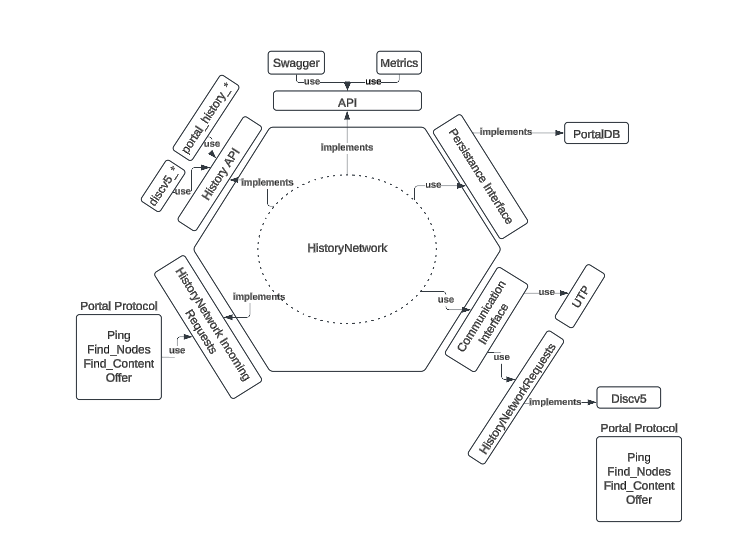

# Samba


Samba is an [Ethereum portal client](https://github.com/ethereum/portal-network-specs) written in Java language based
on [Teku](https://github.com/Consensys/teku) and [Besu](https://github.com/hyperledger/besu).
The name is inspired by the shortened name of of rescue dog named Sambayon that is the Spanish translation of an Italian dessert.

> **Note:** Samba is still **under heavy development** and is not yet ready for production use.

## High level node architecture diagram



## Build Instructions

### Install Prerequisites

* Java 21+

Building on a more recent version of Java is supported, but the resulting build will not work on earlier versions of Java.


### Build and Dist

To create a ready to run distribution:

```shell script
git clone https://github.com/meldsun0/samba
cd samba && ./gradlew

```

This produces:
- Fully packaged distribution in `build/distributions`
### Build and Test

To build, clone this repo and run with `gradle`:

```shell script
git clone https://github.com/meldsun0/samba
cd samba && ./gradlew

```

After a successful build, distribution packages are available in `build/distributions`.

### Other Useful Gradle Targets

| Target      | Builds                                                  |
|-------------|---------------------------------------------------------|
| distTar     | Full distribution in build/distributions (as `.tar.gz`) |
| distZip     | Full distribution in build/distributions (as `.zip`)    |
| distDocker  | The `meldsun_labs/samba` docker image                   |

## Code Style

We use Google's Java coding conventions for the project. To reformat code, run:

```shell script
./gradlew spotlessApply
```

Code style is checked automatically during a build.

## Testing

All the unit tests are run as part of the build, but can be explicitly triggered with:

```shell script
./gradlew test
```

## Docker


## Hardware Requirements

Minimum:

TO-DO

Recommended:

TO-DO


### Useful links:
* [Devcon SEA History Expiry and Portal Network session](https://notes.ethereum.org/_XVO7jmXTGOwZmhR5-3T9Q)
* [EIP-4444 Implementation Plan: History Expiry in Ethereum](https://hackmd.io/Dobc38YVQ1qmbbyI6LcFqA)
* [Playground](https://playground.open-rpc.org/?schemaUrl=https://raw.githubusercontent.com/ethereum/portal-network-specs/assembled-spec/jsonrpc/openrpc.json)
* https://eips.ethereum.org/EIPS/eip-7639
* https://eips.ethereum.org/EIPS/eip-4444